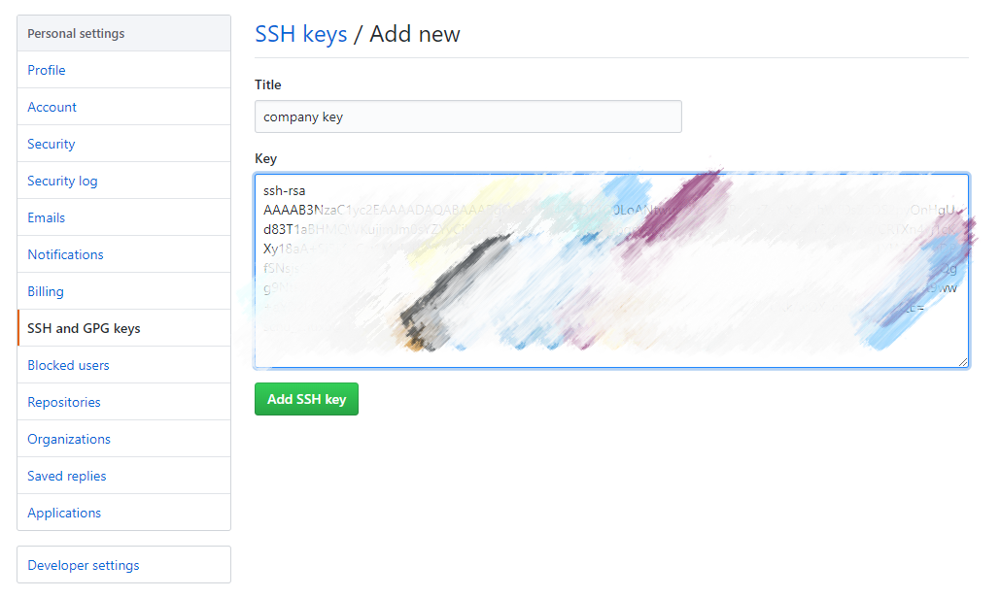

# Git Github 和 GitLab 的使用

参考廖雪峰老师的 [Git教程](https://www.liaoxuefeng.com/wiki/896043488029600)。

Git是一个开源的分布式版本控制系统，可以有效、高速地处理从很小到非常大的项目版本管理。而 Github 是 Git 的代码托管平台。

## 注册 Github 账号
Github 官网：[https://github.com/](https://github.com/)

## 在 Windows 上安装 Git
Git 官方下载地址：[https://git-scm.com/downloads](https://git-scm.com/downloads)，这个链接国内基本下不了，考虑使用国内镜像：[https://npm.taobao.org/mirrors/git-for-windows/](https://npm.taobao.org/mirrors/git-for-windows/)，下载完成之后按默认选项安装即可。
在安装路径下找到命令行工具 git-bash.exe，表明已经安装完成。

## Git 配置用户名和邮箱
Git安装完成后，在命令行工具中配置 Github 用户名和账号：
~~~bash
git config --global user.name "username"
git config --global user.email "example@email.com"
~~~

你也可以查看已经配置的信息
~~~bash
git config user.name
git config user.email
~~~

## 创建仓库（Repository）
在本地创建一个目录，假设为 test，然后在该路径下初始化 git：
~~~bash
git init
~~~
此时，在该目录下，就会生成一个.git 文件，这个文件能够跟踪仓库的变化。

## 向仓库中添加文件
1.在文件夹下创建文件，例如，readme.txt，内容如下（Windows 下不要使用记事本编辑，会有编码问题，建议使用其他编辑器）：
~~~
Git test text.
~~~

2.使用 git add 命令把文件从工作区添加到仓库的暂存区中：
~~~bash
git add readme.txt
~~~
没有提示，说明添加文件的步骤没有问题。
可以使用 git add . 命令添加当前文件夹的内容。

3.使用 git commit 命令将文件提交到仓库：
~~~bash
git commit -m "添加readme文件"
~~~
项目提交到仓库之后，项目的修改会记录在仓库中，其中，-m 表示提交说明，便于查看修改记录。

## 查看仓库修改
我们对仓库中的文件进行了修改，例如修改 readme.txt 的内容：
~~~
Git test text.
Git modify text.
~~~
假设我们已经不记得项目做了什么改动，则我们可以使用 git status 查看工作区与暂存区有何不同：
~~~bash
$ git status
On branch master
Changes not staged for commit:
  (use "git add <file>..." to update what will be committed)
  (use "git restore <file>..." to discard changes in working directory)
        modified:   readme.txt

no changes added to commit (use "git add" and/or "git commit -a")
~~~

现在，我们知道 readme.txt 文件被我们改动过却还没被提交，不过，我们不知道这个文件具体什么内容被改过，此时，我们可以使用 git diff 命令：
~~~bash
$ git diff readme.txt
diff --git a/readme.txt b/readme.txt
index dccdf42..7756e46 100644
--- a/readme.txt
+++ b/readme.txt
@@ -1 +1,2 @@
-Git test text.
\ No newline at end of file
+Git test text.
+Git modify text.
\ No newline at end of file
~~~

知道这个文件什么地方被改动过之后，我们可以安心地提交了，使用 git add 和 git commit 命令，然后我们再使用 git status 查看仓库的状态：
~~~bash
$ git status
On branch master
nothing to commit, working tree clean
~~~
此时，所有修改已经提交到仓库了。

实际上，在 Windows 的 GUI 中，我们还可以方便地查看项目工作区的改动：

图1是还没有提交，图2是已经提交。

## 版本回退
1.使用 git log 可以查看仓库历史修改：
~~~bash
$ git log
commit 63b4822cc2b4ba69a5ee7935fb8eb3bde0b68c58 (HEAD -> master)
Author: WildHico <scnu_zhuxu@163.com>
Date:   Fri Jan 17 16:11:44 2020 +0800

    修改readme文件

commit 34ad77e9b28261ad84aa4338d0ab684a0e28f391
Author: WildHico <scnu_zhuxu@163.com>
Date:   Fri Jan 17 15:47:35 2020 +0800

    添加readme文件
~~~
其中，commit 后面的长串表示每一次提交的版本号。

2.使用 git reset 命令控制版本回退：
~~~bash
$ git reset --hard HEAD^
HEAD is now at 34ad77e 添加readme文件
~~~
其中，HEAD^ 表示上一个版本，HEAD^^ 表示上上个版本，当然，我们也可以使用每个版本对应的版本号，或者版本号的前几位。

3.使用 git reflog 查看修改日志
使用 git log 查看历史记录时，只能查看到当前版本及以前的记录，当我们从某个版本回退到当前版本时，当前版本往后的版本就无法查看，也无法直接回退到这些版本。此时，我们就需要使用 git reflog 查看每次修改的版本号，然后再根据版本号回退：
~~~bash
$ git reflog
34ad77e (HEAD -> master) HEAD@{0}: reset: moving to HEAD^
63b4822 HEAD@{1}: commit: 修改readme文件
34ad77e (HEAD -> master) HEAD@{2}: commit (initial): 添加readme文件
~~~

* 其他Git常见撤销操作参考：[https://mp.weixin.qq.com/s/VhMgTq993lTqGIvcDSaOZQ](https://mp.weixin.qq.com/s/VhMgTq993lTqGIvcDSaOZQ)

## 删除文件
我们先创建一个新文件，命名为 test.txt，然后提交到仓库。

删除文件分两种情况：

1.当我们删除工作区的文件，希望更新到工作区，把仓库中的文件也删除，可以先使用 git rm 命令删除文件，然后再 commit：
~~~bash
$ git rm test.txt
rm 'test.txt'

$ git commit -m "删除test.txt文件"
[master 1758c35] 删除test.txt文件
 1 file changed, 0 insertions(+), 0 deletions(-)
 delete mode 100644 test.txt
~~~
使用以上命令，即使我们没有手动删除工作区的文件，也会自动删除。

2.当我们误删工作区的文件，希望从仓库中恢复文件，可以使用 git checkout 命令：
~~~bash
git checkout -- test.txt
~~~

## 关联远程仓库
Github 是 一个为 Git 提供远程仓库托管服务的网站。

#### 一、创建和设置SSH Key
1.创建 SSH key
如果用户主目录下有 .ssh目录且该目录下有 id_rsa 和 id_rsa.pub 文件，说明 SSH key 已经创建完成，否则打开命令行工具，输入：
~~~bash
ssh-keygen -t rsa -C "example@email.com"
~~~ 
使用 Github 邮箱，一路回车，创建成功后可以在用户主目录下看到 .ssh 目录，以及目录下的 id_rsa 和 id_rsa.pub 文件，其中，前者为私钥，后者为公钥。 

2.设置 SSH key
登录 Github 账号，打开 Settings - SSH keys - New SSH key，输入Title，将 id_rsa.pub 文件的内容粘贴到 Key：

SSH key 起识别作用，添加 SSH key 相当于将对应电脑添加到远程仓库的白名单中。

#### 二、关联远程仓库
1.创建远程仓库，如果已经有，则跳过
登录 Github，打开 Add New Repository，输入仓库的名称和描述。

2.关联本地仓库和远程仓库
在命令行工具下输入：
~~~bash
git remote add origin git@github.com:Name/Git-Test.git
~~~

其中，origin 远程库的默认叫法，Name 为 Github 账号名，Git-Test 为远程仓库的名称。

3.将本地仓库的内容推送到远程库：
~~~bash
git push -u origin master

The authenticity of host 'github.com (13.250.177.223)' can't be established.
RSA key fingerprint is SHA256:nThbg6kXUpJWGl7E1IGOCspRomTxdCARLviKw6E5SY8.
Are you sure you want to continue connecting (yes/no/[fingerprint])? yes

Warning: Permanently added 'github.com,13.250.177.223' (RSA) to the list of known hosts.
Enumerating objects: 6, done.
Counting objects: 100% (6/6), done.
Delta compression using up to 4 threads
Compressing objects: 100% (3/3), done.
Writing objects: 100% (6/6), 507 bytes | 253.00 KiB/s, done.
Total 6 (delta 0), reused 0 (delta 0)
To github.com:WildHico/Git-Test.git
 * [new branch]      master -> master
Branch 'master' set up to track remote branch 'master' from 'origin'.

~~~
第一次推送时使用 -u 参数，关联本地 master 分支和远程的 master 分支，第一次推送时还会出现警告。

## 克隆远程仓库

~~~bash
git clone git@github.com:younghz/Markdown.git
~~~

* 克隆指定分支
~~~bash
git clone -b branch_name git@github.com:younghz/Markdown.git
~~~

## 从远程仓库抓取

## 分支管理
* 创建分支
~~~bash
git checkout -b test
~~~
以上命令表示创建并切换到分支 test，相当于以下两条命令：
~~~bash
git branch test
git checkout test

Switched to branch 'test'
~~~

或者使用新版 switch 指令代替 checkout 指令：
~~~bash
git switch -c test
~~~

* 查看分支
~~~bash
git branch

  master
* test
~~~
其中，前面带 * 的表示当前分支。

* 切换分支
~~~bash
git checkout master
~~~
或者
~~~bash
git switch master
~~~

* 将分支合并到主分支（需要先切换到主分支）
~~~bash
git merge test
~~~

* 删除分支（需要先切换到其他分支）
~~~bash
git branch -d test
~~~
